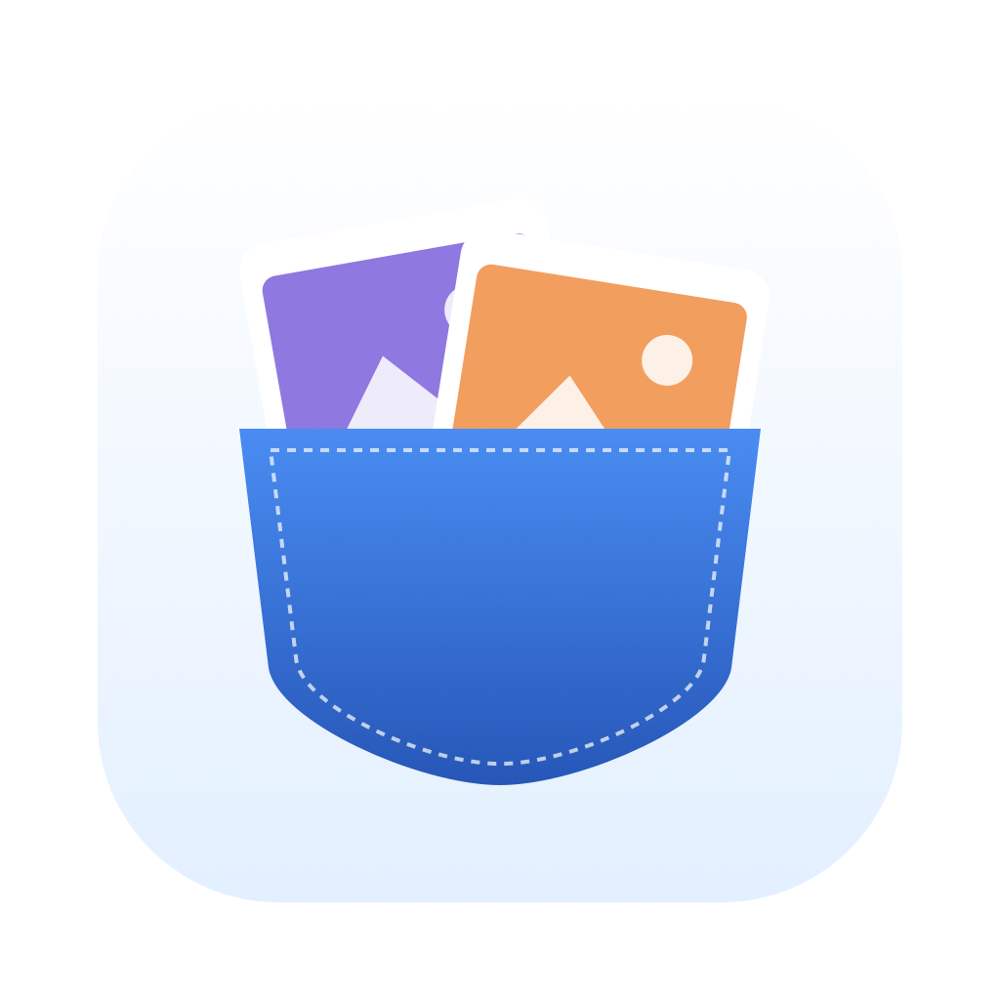

# PicPocket



Your latest six screenshots, in a small pocket at the bottom-right corner of your Mac.

A new screenshot opens the pocket briefly. Rest the pointer in the bottom-right
corner to open it again, including over full-screen apps. It stays open while
you interact and hides when you move away.

Free and open source. For macOS 14 and later, on Apple silicon and Intel Macs.

[Download ›](https://github.com/SpeedyPetey/picpocket/releases/latest/download/PicPocket-1.0.0.dmg) · [Build from source ›](https://github.com/SpeedyPetey/picpocket#build-from-source)

## Install

Download the DMG, open it, and drag **PicPocket.app** into **Applications**.
Launch PicPocket, then rest your pointer in the bottom-right corner to open it.
Quit any previous running copy before installing an update.

This release is ad hoc signed and is **not notarized by Apple**. macOS may block
its first launch. If you trust this download, open **System Settings → Privacy
& Security** and use **Open Anyway** after attempting to launch it.

## Build from source

Requires macOS 14 or later and a Swift toolchain.

```sh
git clone https://github.com/SpeedyPetey/picpocket.git
cd picpocket
```

```sh
swift run PicPocket
```

PicPocket runs quietly without a menu-bar icon. Open it from the bottom-right corner. Quit the previous running copy before launching
a rebuilt version. Press Control + C in Terminal to stop a command-line run.

To build a standalone app:

```sh
scripts/build-app.sh
open build/PicPocket.app
```

Move PicPocket.app to Applications before enabling **Open at login**.
Local builds are signed ad hoc unless a Developer ID is configured; this fork
is not distributed as a notarized release.

## Screenshot actions

| Gesture | Action |
|:--|:--|
| Click | Copy the image |
| Double-click | Open the image |
| Press and hold | Edit in Markup |
| Drag into an app | Share a copy |
| Drag into a folder | Move the file there |
| Click the cross or drag to Trash | Discard |
| Right-click | More screenshot actions |
| Control + Option + T | Show or hide the pocket |

Removing a screenshot uses a hand animation: left-column photos pull left,
right-column photos pull right. The remaining photos slide into the gap only
after the departing image is fully gone. With Reduce Motion enabled, the image
fades out before the others move.

The cross trashes screenshots in PicPocket's managed folder. For screenshots
stored elsewhere, it only removes them from the pocket and leaves the file in
place. Dragging to Trash deletes the file in either case.

Click the pocket icon in the header to see today's screenshot count.

The gear button beside **Your PicPocket** opens settings containing **Show pocket / Hide pocket**, **Empty pocket**,
**Handle screenshots**, **Open screenshots folder**, **Sounds**,
**Open at login**, and **Quit PicPocket**.

**Handle screenshots** sends captures directly into PicPocket's folder and
turns off the macOS floating thumbnail. Previous screenshot settings are
restored when you disable it or quit. Existing installations retain their
previous screenshot folder and internal preference identity during the rename.

No account, network service, or analytics. Screenshots stay on your Mac.

## Development

```sh
swift test
```

Swift, AppKit, and SwiftUI. `scripts/make-icon.swift` draws the app icon;
`scripts/make-dmg.sh` builds a universal app and packages it as
`build/PicPocket-1.0.0.dmg` for distribution. When a Developer ID certificate and
the `picpocket-notary` keychain profile are configured, the script also signs,
notarizes, and staples the disk image.

## Credits

PicPocket is based on [Tendedero by Alejandro Buján](https://github.com/alejandrobujan/tendedero).
The original code is MIT licensed; see [LICENSE](LICENSE). PicPocket uses its
own name and pocket icon. Older artwork retained in `docs/` depicts the upstream
app and is not used as PicPocket's app icon.
